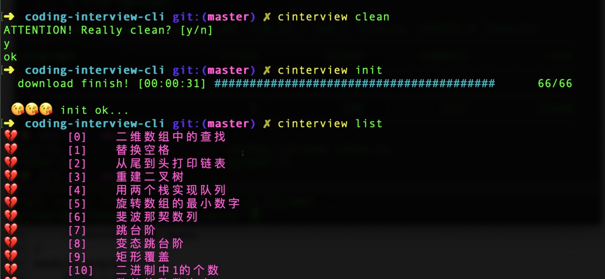

# coding-interview CLI

My goal is to implement a CLI tool like [leetcode-cli](https://github.com/skygragon/leetcode-cli). And my teammate([@曾德勤
](https://github.com/Zendq1998)) will wrap it to a 
Virsual Studio Code extension like [this](https://github.com/jdneo/vscode-leetcode).

## install

clone this repo:
```
git clone ...
```

install cargo for rust:
```
# for linux or macOS
curl -sSf https://static.rust-lang.org/rustup.sh | sh
```

run:
```
cargo run
```

## commands

### login or not login
**Login mode is to be implemented**

There are two mode: login or not login. If you login, the submit history will be based on the remote history of you acount. And if not, it's based on your local log.

The default mode is not login.

```
# change to login mode
cinterview login

# then input username
# and input password
```

### init
Download problem details from network. And coding templates will be generated in the current directory.
```
cinterview init
```

For example:



### clean
Clean local problems data.
```
cinterview clean
```

### list
get current problems status
```
cinterview list
```

### submit

```
# -e means exams mode
cinterview submit -e 12

# -t means test mode
cinterview submit -t 12
```

The difference between these two mode is whether you can get the error message if your code is not correct. Default it test mode.

